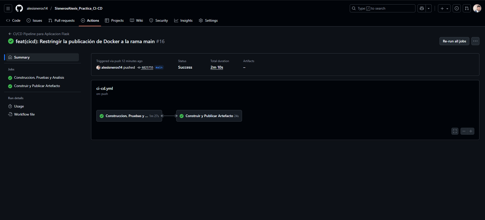
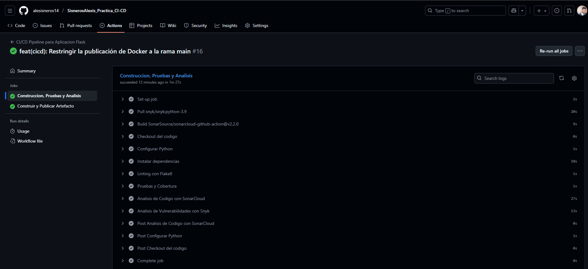
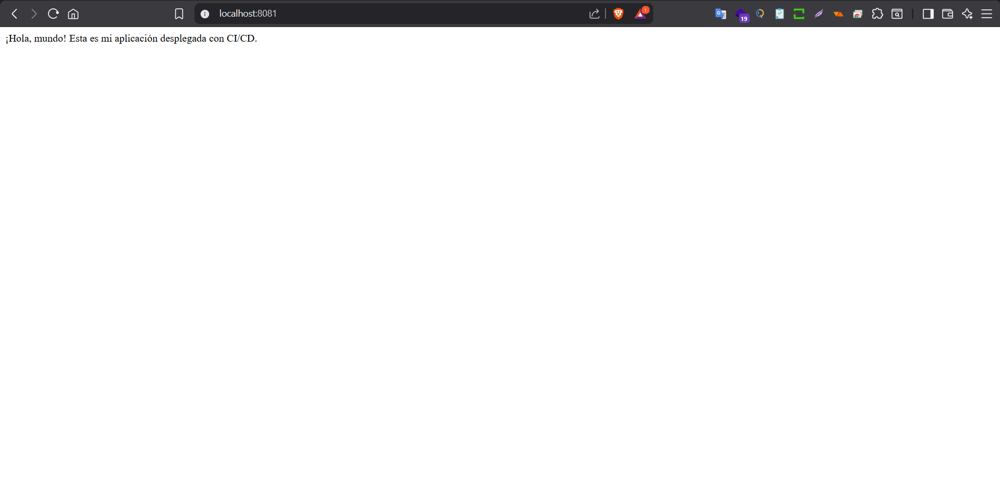
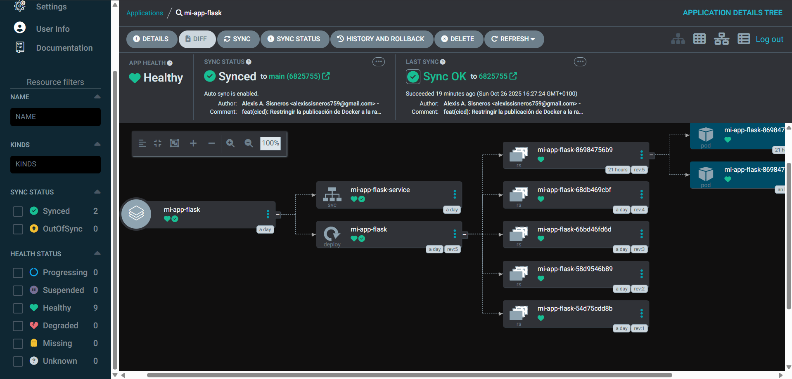
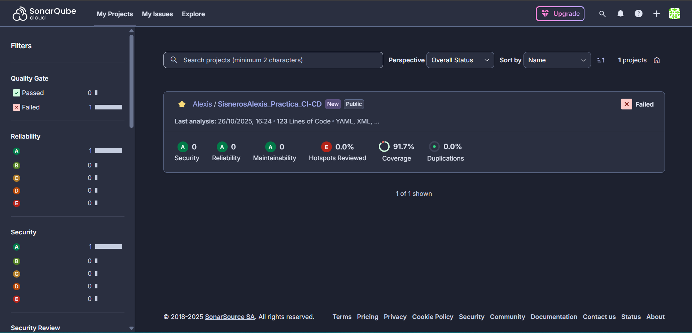
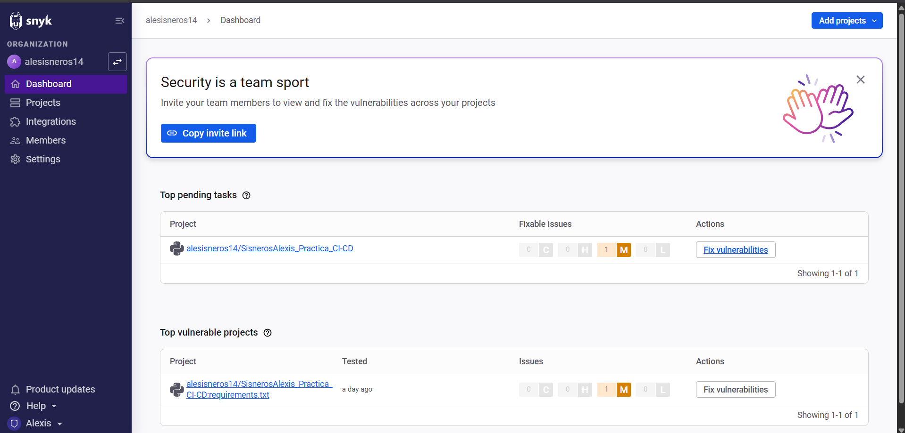

# Práctica de CI/CD: Aplicación Flask con Despliegue GitOps

Este repositorio contiene el código fuente y la configuración para una práctica de DevOps que implementa un pipeline completo de Integración Continua (CI) y Despliegue Continuo (CD) para una aplicación web simple desarrollada en Python con Flask.

El objetivo de este proyecto es demostrar un flujo de trabajo moderno de GitOps, donde los cambios en el código desencadenan automáticamente una serie de validaciones de calidad y seguridad, la construcción de un artefacto y su despliegue en un clúster de Kubernetes.

## Arquitectura y Tecnologías Utilizadas

- **Aplicación:** Python 3.9 + Flask
- **Gestión de Dependencias:** Pip + `requirements.txt`
- **Contenerización:** Docker
- **Control de Versiones:** Git con flujo de trabajo GitFlow
- **CI/CD:** GitHub Actions
- **Análisis de Calidad y Seguridad:**
  - **Linting:** Flake8
  - **Pruebas Unitarias:** Pytest con `pytest-cov` para cobertura
  - **Análisis Estático de Código:** SonarCloud
  - **Análisis de Vulnerabilidades:** Snyk
- **Registro de Artefactos:** GitHub Packages (Container Registry)
- **Despliegue Continuo (GitOps):** ArgoCD
- **Orquestación:** Kubernetes

## Estructura del Repositorio

```
.
├── .github/
│   └── workflows/
│       └── ci-cd.yml       # Definición del pipeline de CI/CD
├── k8s/
│   ├── deployment.yaml     # Manifiesto de Kubernetes para el Deployment
│   └── service.yaml        # Manifiesto de Kubernetes para el Service
├── tests/
│   ├── __init__.py
│   └── test_app.py         # Pruebas unitarias de la aplicación
├── app.py                  # Código fuente de la aplicación Flask
├── Dockerfile              # Receta para construir la imagen Docker
├── requirements.txt        # Dependencias de Python
├── sonar-project.properties # Configuración para el análisis de SonarCloud
└── README.md               # Documentación del proyecto
```

## Flujo de Trabajo CI/CD

El pipeline se activa con cada `push` a las ramas `develop` y `main`.

1.  **Rama `develop` (Integración Continua):**
    - Se instalan las dependencias.
    - Se ejecutan los linters (Flake8).
    - Se ejecutan las pruebas unitarias (Pytest) y se genera un informe de cobertura.
    - Se realiza un análisis de código con SonarCloud.
    - Se realiza un análisis de vulnerabilidades con Snyk.

2.  **Rama `main` (Despliegue Continuo):**
    - Se ejecutan todos los pasos de la rama `develop`.
    - **Si todos los pasos son exitosos**, se procede a construir una imagen Docker.
    - La imagen se etiqueta con `:latest` y con el hash del commit de Git.
    - La imagen se publica en GitHub Packages.
    - ArgoCD, que está monitoreando la rama `main`, detecta la nueva imagen (o cambios en los manifiestos de `k8s/`) y sincroniza automáticamente el estado del clúster de Kubernetes, desplegando la nueva versión de la aplicación.

## Cómo Replicar el Despliegue (Instrucciones para el Evaluador)

Para desplegar esta aplicación en un clúster de Kubernetes propio usando la misma metodología GitOps, sigue estos pasos.

### Prerrequisitos

1.  Un clúster de Kubernetes (ej. Minikube, Docker Desktop, o un proveedor cloud).
2.  `kubectl` configurado para apuntar a tu clúster.
3.  ArgoCD instalado en el clúster. Puedes seguir la [guía oficial](https://argo-cd.readthedocs.io/en/stable/getting_started/).

### Pasos para el Despliegue

1.  **Hacer un Fork de este Repositorio:**
    Haz clic en el botón "Fork" en la esquina superior derecha de esta página para crear una copia de este repositorio en tu propia cuenta de GitHub.

2.  **Crear un Secreto para Descargar la Imagen:**
    La imagen Docker en este proyecto es privada. Kubernetes necesita credenciales para descargarla.
    - **Crea un Personal Access Token (PAT) en GitHub** con el permiso `read:packages`.
    - **Crea un secreto de Kubernetes** en tu clúster con el siguiente comando, reemplazando los placeholders:
      ```bash
      kubectl create secret docker-registry ghcr-secret \
        --docker-server=ghcr.io \
        --docker-username=TU_USUARIO_DE_GITHUB \
        --docker-password=TU_PERSONAL_ACCESS_TOKEN \
        --namespace=argocd # O el namespace donde vayas a instalar ArgoCD
      ```

3.  **Crear la Aplicación en ArgoCD:**
    Puedes crear la aplicación a través de la UI de ArgoCD o aplicando un manifiesto.

    **Opción A: Vía la UI de ArgoCD**
    - Accede a tu interfaz de ArgoCD.
    - Haz clic en `+ NEW APP`.
    - Rellena los siguientes campos:
      - **Application Name:** `mi-app-flask`
      - **Project:** `default`
      - **Sync Policy:** `Automatic`, `Prune Resources`, `Self Heal`
      - **Repository URL:** La URL de **tu fork** del repositorio.
      - **Revision:** `main`
      - **Path:** `k8s`
      - **Cluster URL:** `https://kubernetes.default.svc`
      - **Namespace:** `default`
    - Haz clic en `CREATE`.

    **Opción B: Vía `kubectl` (Declarativo)**
    Crea un archivo `argocd-application.yaml` con el siguiente contenido (asegúrate de cambiar la `repoURL`) y aplícalo con `kubectl apply -f argocd-application.yaml`.
    ```yaml
    apiVersion: argoproj.io/v1alpha1
    kind: Application
    metadata:
      name: mi-app-flask
      namespace: argocd
    spec:
      project: default
      source:
        repoURL: 'https://github.com/TU_USUARIO_DE_GITHUB/SisnerosAlexis_Practica_CI-CD.git'
        targetRevision: main
        path: k8s
      destination:
        server: 'https://kubernetes.default.svc'
        namespace: default
      syncPolicy:
        automated:
          prune: true
          selfHeal: true
    ```

4.  **¡Verificar el Despliegue!**
    Después de unos momentos, ArgoCD sincronizará los manifiestos del repositorio y desplegará la aplicación. El estado en la UI de ArgoCD debería cambiar a `Healthy` y `Synced`.

## Entregables de la Práctica

A continuación se presentan los enlaces y evidencias correspondientes a cada uno de los puntos solicitados para la entrega.

**1. Repositorio de GitHub:**
- [https://github.com/alesisneros14/SisnerosAlexis_Practica_CI-CD](https://github.com/alesisneros14/SisnerosAlexis_Practica_CI-CD)

**2. Repositorio de Artefactos (GitHub Packages):**
- **Enlace:** [Ver Paquete de Contenedor en GitHub Packages](https://github.com/alesisneros14/SisnerosAlexis_Practica_CI-CD/pkgs/container/sisnerosalexis_practica_ci-cd)
- **Screenshot:**
  

**3. Fichero de Configuración del Pipeline:**
- [`.github/workflows/ci-cd.yml`](https://github.com/alesisneros14/SisnerosAlexis_Practica_CI-CD/blob/main/.github/workflows/ci-cd.yml)

**4. Screenshots del Pipeline de CI/CD:**
- **Resumen de Ejecución Exitosa:**
  
- **Detalle de los Pasos del Job de CI:**
  

**5. Manifiestos de Kubernetes:**
- **Deployment:** [`k8s/deployment.yaml`](https://github.com/alesisneros14/SisnerosAlexis_Practica_CI-CD/blob/main/k8s/deployment.yaml)
- **Service:** [`k8s/service.yaml`](https://github.com/alesisneros14/SisnerosAlexis_Practica_CI-CD/blob/main/k8s/service.yaml)

**6. Screenshot de la Aplicación Desplegada:**


**7. Screenshot del Proyecto en ArgoCD:**


**8. Screenshot del Proyecto en SonarCloud:**


**9. Screenshot del Proyecto en Snyk:**


**10. Vídeo Explicativo en Drive:**
- **Enlace:** `https://drive.google.com/file/d/15HuUFeE6OVBWW4zyBVJSy7rk5yGg4FmS/view?usp=sharing`

---
*Este proyecto fue creado como parte de la práctica de CI/CD.*
*Autor: Sisneros, Alexis Adrián*
*Fecha: Octubre 2025*